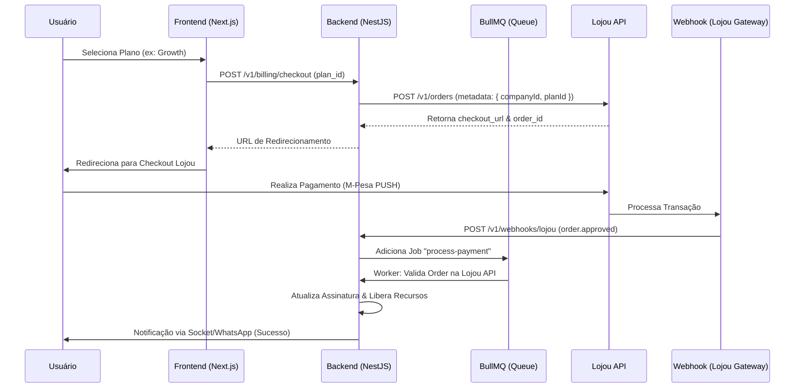

# 💳 Especificação Técnica: Engine de Faturamento Komunika (Lojou.app Core)
// Versão: 2.0 - Enterprise Grade
// Status: Ready for Implementation

Este documento define a arquitetura de **missão crítica** para a integração do Komunika com a infraestrutura de pagamentos da **Lojou.app**. O objetivo é suportar escala massiva, garantir 100% de integridade transacional e fornecer uma experiência de checkout industrial.

---

## 1. Arquitetura de Fluxo (E2E)
// Orquestração assíncrona para garantir durabilidade de dados

O fluxo abaixo descreve a orquestração entre o Frontend, Backend (Komunika), Gateway (Lojou) e os Provedores de Pagamento (M-Pesa/e-mola).



---

## 2. Design do Banco de Dados (Prisma Schema)
// Estrutura normalizada para suporte a faturas e histórico de transações

```prisma
// Extensão do Schema Atual para Faturamento
model Subscription {
  id                String    @id @default(uuid())
  companyId         String    @unique
  company           Company   @relation(fields: [companyId], references: [id])
  planId            String    // start, growth, scale, enterprise
  status            String    // trialing, active, overdue, canceled, grace_period
  currentPeriodEnd  DateTime
  cancelAtPeriodEnd Boolean   @default(false)
  lojouCustomerId   String?   // ID do cliente no gateway
  trialEndsAt       DateTime?
  lastInvoiceUrl    String?   // PDF da última fatura da Lojou
  createdAt         DateTime  @default(now())
  updatedAt         DateTime  @updatedAt
}

model Transaction {
  id              String   @id @default(uuid())
  companyId       String
  orderId         String   @unique // ID da Lojou (ord_...)
  amount          Float
  currency        String   @default("MZN")
  status          String   // pending, approved, failed, refunded, disputed
  paymentMethod   String?  // mpesa, emola, bank_transfer
  checkoutUrl     String?
  metadata        Json?    // Log completo do payload da Lojou
  isUpgrade       Boolean  @default(false) // Marcador de pro-rata
  createdAt       DateTime @default(now())
}
```

---

## 3. Segurança e Resiliência Industrial
// Camadas de proteção contra falhas de rede e ataques de spoofing

### 3.1. Proteção de Webhooks (Triple Check)
1. **Header Secret**: Header `X-Lojou-Webhook-Secret` obrigatório.
2. **IP Whitelisting**: Aceitar apenas conexões dos IPs oficiais da Lojou.app.
3. **Verified Call-back**: O worker do BullMQ **obrigatoriamente** executa `GET /v1/orders/{id}` na Lojou para confirmar o status antes de qualquer alteração no banco local.

### 3.2. Idempotência e Retries
// Garantia de faturamento zero-loss
- **Worker Retry**: Se o processamento do pagamento falhar, a fila BullMQ retenta em 2s, 10s, 1m, 10m até sucesso.
- **Deduplicação**: O `orderId` da Lojou é chave única no banco de dados para evitar liberação dupla de crédito.

---

## 4. Lógica de Negócio Avançada (Scale-Ready)

### 4.1. Gestão de Dunning & Grace Period
// Política de retenção e tratamento de inadimplência
- **Fase de Grace (Carência)**: Quando uma assinatura expira, o status muda para `grace_period` por 72 horas.
- **Notificações**: 
  - T-1 (Vencendo amanhã): Alerta via WhatsApp.
  - T+0 (Vencido hoje): Alerta de "Tentativa de Cobrança Falhou".
  - T+3: Bloqueio total do acesso (`overdue`).

### 4.2. Upgrade e Pro-rata (Recálculo Dinâmico)
// Lógica para usuários que mudam de plano no meio do ciclo
Ao realizar um upgrade (ex: Start -> Growth):
1. Calcula valor diário do plano atual: `Price / 30`.
2. Calcula dias não usados: `DaysRemaining`.
3. Gera crédito pro-rata: `Credit = PricePerDay * DaysRemaining`.
4. Novo valor do checkout = `NewPlanPrice - Credit`.
5. Status `isUpgrade` marcado como `true` na transação para auditoria.

### 4.3. Motor de Promoções e Cupons
// Validação lado servidor antes do checkout
Endpoint: `POST /v1/billing/validate-coupon`
- Verifica validade do cupom via `GET /v1/discounts/{code}`.
- Aplica o desconto no cálculo do `amount` enviado para `POST /v1/orders`.
- Bloqueia o uso de cupons expirados no frontend do Komunika.

---

## 5. Fluxo de Estornos e Disputas
// Integridade financeira bidirecional

Ao receber o evento `order.refunded` no Webhook:
1. O sistema identifica a transação vinculada pelo `orderId`.
2. Atualiza o status da transação para `refunded`.
3. Reverte os limites da empresa (ex: reduz número de conexões ativas permitidas).
4. Dispara alerta para o Admin do Komunika no WhatsApp.

---

## 6. Observabilidade e Telemetria
// Monitoramento em tempo real da "Saúde Financeira" da plataforma

### 6.1. Tracing e Performance
- **Time-to-Checkout**: Monitorar latência entre o clique do usuário e a resposta da Lojou.
- **Success Rate**: Gráfico de `Orders Criadas` vs `Orders Pagas`.

### 6.2. Dashboard de Conciliação (Painel Admin)
Interface técnica para detectar divergências:
- **Alertas Críticos**: Pedido marcado como `approved` na Lojou mas `pending` no Komunika.
- **Relatório de Mismatch**: Listagem de `last_sync_error`.

---

## 7. Frontend Billing UI (Especificação)
// Interface intuitiva focado em Self-Service

Componentes críticos no Dashboard:
1. **Subscription Status Card**: Exibe plano atual, data de renovação e botão de upgrade.
2. **Invoice History**: Tabela com links `lastInvoiceUrl` para download de faturas.
3. **Retention Flow**: Se o usuário tentar cancelar, o sistema oferece 10% de desconto automático (via cupom Lojou) antes de confirmar o `cancelAtPeriodEnd`.

---

## 8. Mapeamento de Status Industrial

| Status Lojou | Status Komunika | Ação no Sistema |
|:--- |:--- |:--- |
| `pending` | `PAYMENT_PENDING` | Mantém acesso atual, exibe banner informativo. |
| `approved` | `ACTIVE` | Estende `currentPeriodEnd`, libera limites instantaneamente. |
| `cancelled` | `PAYMENT_FAILED` | Notifica usuário via toast, permite re-tentativa imediata. |
| `refunded` | `CANCELED` | Bloqueia acesso, interrompe todas as campanhas de voz. |

---

> [!IMPORTANT]
> **Pilar de Confiança**: Esta arquitetura foi desenhada para que o Komunika nunca perca uma transação. Se a Lojou enviar o webhook e o Komunika falhar, o Redis/BullMQ garante a retentativa. Se o Webhook nunca chegar, o Cron Job de conciliação resolve às 00:00 de cada dia.
